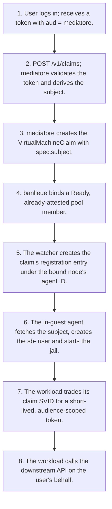
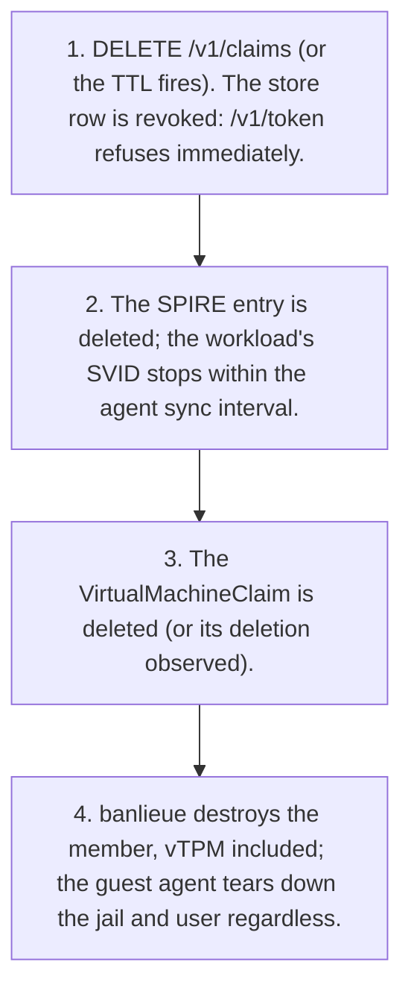

# Architecture Flows

!!! note "Auto-generated"

    Rendered from `docs/architecture/calm/architecture.json` by the CALM
    CLI (`calm template`). **Do not edit this file by hand** — edit the
    architecture JSON or the Handlebars template at
    `docs/architecture/calm/templates/mermaid/flows.md.hbs` and regenerate
    with `make calm-diagrams`.

Each business flow defined in the CALM architecture is rendered below as
its own Mermaid `flowchart TD` — one diagram per flow, linking the
transitions in sequence order. Three flows are modelled today:

- **Create a VirtualMachine** — the happy path from `kubectl apply` to
  `Ready=true`.
- **Swap a VirtualMachine's backend** — the canonical least-touch
  demonstration: change one field, the controller rebuilds the infra.
- **Delete a VirtualMachine** — finalizer-gated teardown that guarantees
  no backend leaks.

## Claim a sandbox and act as the user

The happy path from login to a delegated downstream call: login, claim, bind, subject fetch, jail, token.

Source: flow `flow-claim-to-token` in `architecture.json`.

## Release and cut-off

Any of four independent cut-offs stops the sandbox acting as the user; this is the ordered normal release.

Source: flow `flow-release-cutoff` in `architecture.json`.

