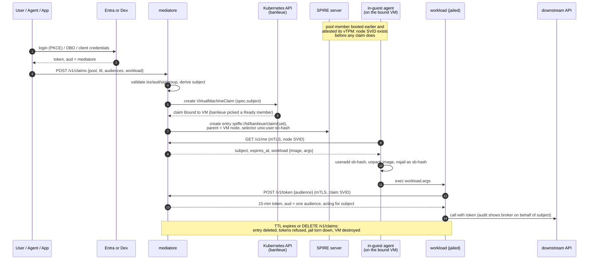
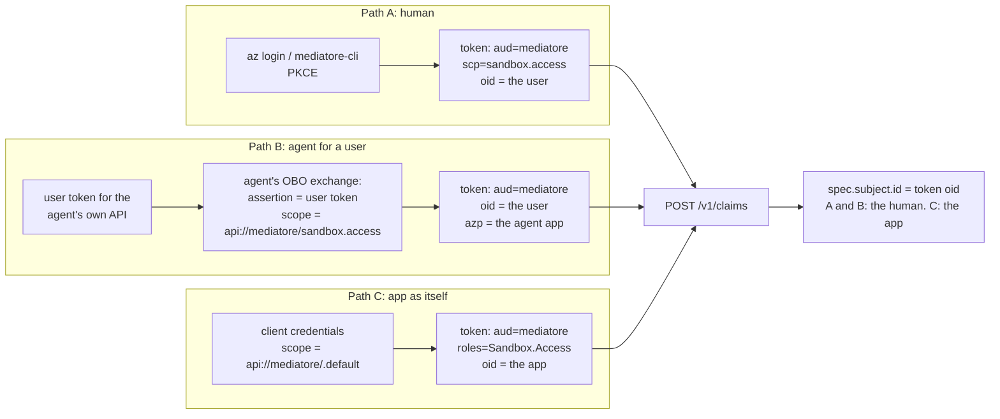

<!-- Copyright (c) 2026 Erick Bourgeois, mediatore -->
<!-- SPDX-License-Identifier: Apache-2.0 -->

# Running workloads on a claimed VM

How code actually ends up executing inside a sandbox, for each kind of caller:

- **A** — a human user, directly;
- **B** — an existing agent (an orchestrator, a bot, a CI job) acting *on behalf of* a
  user;
- **C** — a service acting *as itself*, with an app-only JWT from another Entra ID app
  registration.

All three converge on the same call — `POST /v1/claims` with a bearer token whose
audience is mediatore — and everything after that call is identical. The differences
are only in how the token was obtained and who the sandbox's *subject* ends up being.

## The one rule that shapes everything

**Nothing inbound ever reaches the VM.** There is no SSH, no exec API, no reverse
channel from mediatore. The workload is declared *at claim time* (`workload.image` +
`workload.args`), started by the in-guest agent, and speaks to the world only through
its allowed egress: mediatore's sandbox listener and the claim's downstream audiences.
If you need interactivity, the workload dials **out** (see
[Interaction patterns](#interaction-patterns)).

## Path A: a user, directly

1. Log in and get a broker-audience token:

   ```bash
   # Entra (work)
   az login --scope api://mediatore/sandbox.access
   TOKEN=$(az account get-access-token --scope api://mediatore/sandbox.access \
             --query accessToken -o tsv)

   # Dex (homelab): PKCE flow, cross-client audience
   TOKEN=$(mediatore-cli login)
   ```

   The token's `aud` is mediatore and (on Entra) `scp` contains `sandbox.access`.
   A kubectl/kubelogin token for the Kubernetes API does **not** work here — wrong
   audience, rejected with 401 by design.

2. Claim, naming the workload:

   ```bash
   curl -sS https://mediatore.sandbox.example/v1/claims \
     -H "Authorization: Bearer $TOKEN" \
     -d '{
       "pool_ref": "pool-a",
       "ttl_seconds": 3600,
       "audiences": ["api://trading-data"],
       "workload": {
         "image": "registry.internal:5000/sandbox/claude:latest",
         "args": ["/usr/bin/claude", "-p", "reconcile the ledgers"]
       }
     }'
   ```

3. mediatore validates the token, writes `spec.subject` = *you* (`oid` on Entra, the
   GitHub login via Dex), and creates the `VirtualMachineClaim`. banlieue binds a
   warm, already-attested pool member; mediatore creates the claim's SPIFFE entry;
   the in-guest agent fetches the subject, creates your `sb-` user, unpacks the
   image, and starts your command under nsjail. No further input from you is needed
   or possible.



## Path B: an agent acting on behalf of a user

An orchestrating agent (its own confidential Entra app) already holds a token *its
users* gave it — `aud` = the agent's API, not mediatore's. It cannot forward that
token; mediatore would reject the audience. Instead the agent performs its own
**On-Behalf-Of exchange** to get a mediatore-audience token that still carries the
user's identity:



Setup, once, in Entra:

1. The agent's app registration gets a **delegated permission** on mediatore's app
   (`api://mediatore/sandbox.access`) with admin consent.
2. mediatore's app lists the agent in `knownClientApplications` (or the agent is
   pre-authorised), so the consent chain is clean.

At runtime the agent exchanges every user's token before claiming
(`grant_type=jwt-bearer`, `requested_token_use=on_behalf_of`, its own
`client_assertion`). The result: `spec.subject.id` is the **human's** `oid` — the
sandbox belongs to the user, not to the agent. The agent shows up as `azp` in
mediatore's audit log, exactly like mediatore itself shows up as `azp` downstream.
This is runbook §4.3 and the recommendation of open decision #10: an agent claiming
for a user must present an OBO chain, so `subject` is always a human unless the
caller is explicitly app-only.

Two properties worth noticing:

- The user's original token still never reaches mediatore or the VM — mediatore sees
  the OBO *result*, and the VM sees no user token at all, ever.
- The sandbox's downstream tokens are minted for the **user**; the agent cannot widen
  them beyond the audiences it requested at claim time, and the user's Conditional
  Access / revocation applies to the whole chain.

**Homelab note (Dex):** Dex has no OBO. The equivalent is the `trustedPeers`
cross-client flow — the agent's Dex client lists `mediatore` in its audience request
(`audience:server:client_id:mediatore` scope), producing an ID token with
`aud: [agent, mediatore]` and the user's login as subject. Same shape, weaker
attestation of the agent; acceptable at homelab trust levels.

## Path C: a service with an app-only JWT (another Entra app)

A pipeline or scheduled service with no human in the loop uses **client
credentials**:

1. mediatore's app registration defines an **app role** (e.g. `Sandbox.Access`,
   member type *Application*).
2. The calling app is granted that application permission + admin consent.
3. It requests `scope=api://mediatore/.default` with its client secret/certificate
   and receives a token with `aud` = mediatore and `roles: ["Sandbox.Access"]` — no
   `scp`, no user.

mediatore records `spec.subject.id` = the **app's** `oid` and issues downstream
tokens app-only as well (runbook §4.3: OBO is replaced by app-only tokens with
`roles`; there is no user to act for). The `sb-` username derives from the app's
`oid` exactly like a human's. Use this for fleet jobs — nightly report generation,
scheduled data pulls — where the audit trail should say *the service did this*,
not a person.

> Not yet implemented: the `roles`-based authorization gate for app-only tokens rides
> with roadmap 04 (the `required_group` gate already covers `roles` claims
> structurally, but the app-only downstream issuance path is Entra-OBO-backend work).

## What "the workload" is

`workload.image` is an OCI reference the in-guest agent unpacks into
`/mnt/sandbox/rootfs`; `workload.args` is the argv executed under nsjail as the
per-subject user. The jail gives it:

| Inside the jail | Purpose |
| --- | --- |
| `/run/spire/agent.sock` (read-only) | The **only** credential surface: fetch the claim SVID |
| `MEDIATORE_URL` env | Where to trade the SVID for tokens |
| `/work` (writable), tmpfs `/tmp` + `$HOME` | Scratch space, wiped at teardown |
| `sandbox-token` on `$PATH` | `sandbox-token --audience api://trading-data` prints a 15-min bearer |

No token files, no baked-in secrets, no network beyond the broker and the claim's
audiences. For tools that read a bearer from the environment:
`TOKEN=$(sandbox-token --audience ...) exec your-tool`.

## Interaction patterns

Because nothing inbound reaches the VM, pick one of:

1. **Fire-and-forget.** The workload does its job and writes results to a downstream
   API (a bucket-like service, a ticket system, a data API) that was listed in
   `audiences`. The claim's TTL is the job timeout.
2. **Dial-out interactive.** For a conversational agent, run the agent *as* the
   workload and have it connect outward to your orchestrator or relay (WebSocket,
   queue). Register the orchestrator's endpoint as a **downstream audience**: the
   workload then both *reaches* it (egress allowlist) and *authenticates* to it
   (audience-scoped token carrying the subject + the RFC 8693 `act` claim naming the
   sandbox). Your orchestrator can verify it is talking to the sandbox for claim X
   acting for user Y — not just anyone holding a URL.
3. **Poll-the-broker.** The caller polls `GET /v1/claims/{name}` for phase and
   deadline; that endpoint mirrors state but never carries workload output. Output
   always travels via pattern 1 or 2.

## Status and caveats

- Implemented today (dev mode, `make e2e`): the whole loop with the peer identity
  faked; path A end to end against the fake IdP.
- Roadmap 01 makes the SVID legs real (mTLS); 02 gives VMs a real SPIRE server to
  attest to; 03 makes the claim a real `VirtualMachineClaim`; 04 turns on OBO
  (paths B and C at work) and Dex refresh (homelab); 06 adds the OCI unpack and the
  egress allowlist. See [`ROADMAPS.md`](https://github.com/firestoned/mediatore/blob/main/ROADMAPS.md).
- Threat model: the exfiltration window of the 15-minute in-workload token is
  accepted risk R-3; the dial-out pattern narrows what a leaked token can do
  (one audience), and roadmap 07 is the design that removes the window entirely.
